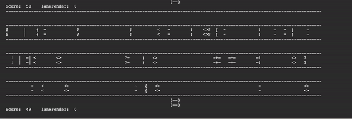

# game-codes
Set of interactive game codes
## _New!_   Crossy road
- Replicating the video game crossy road in Python shell (not graphics window)
- How to play:
  - press control c to move foreward

## Dino game
- Game replicating google chrome's no internet game
- jump by pressing control+c
- more information in dino-game repository

## Game code
- compliling multiple games
- Secret number (same as secret number below)
- Treasure hunt
  - screen shows you an x (random place where the treasure is located)
  - x will disappear and the you have to navigate it
- Army attack
  - interactive game
  - still being developed
- Car racing
  - interactive game
  - still being developed
## Grocery store game 
- interactive game in which animated would have to be put in the right basket by pressing override keys
- words are moving in 3 lanes at the same time in opposite directions
- words will start from the opposite side again when they reach the end
- word can be put in basket using override c+control
## Secret number game
- game in which user has to guess random number
- program will tell wether guess is too high or too low
## Shooter game
- interactive game in which user has to fire bullets using override to hit obstacles
- shooter will chnage direction every second
- still under development
### All of these games are locally and independently played, not over a server
